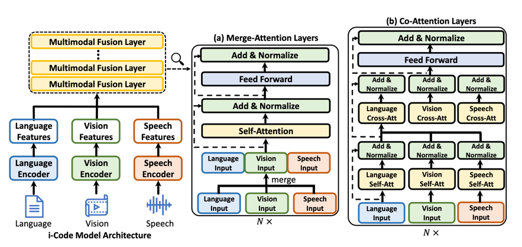
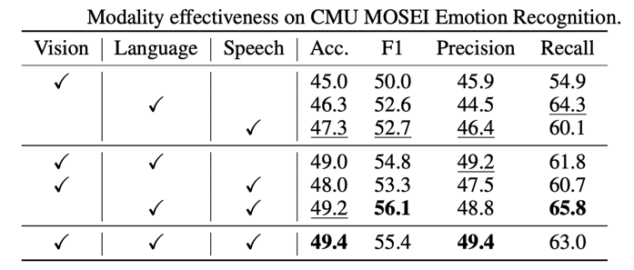
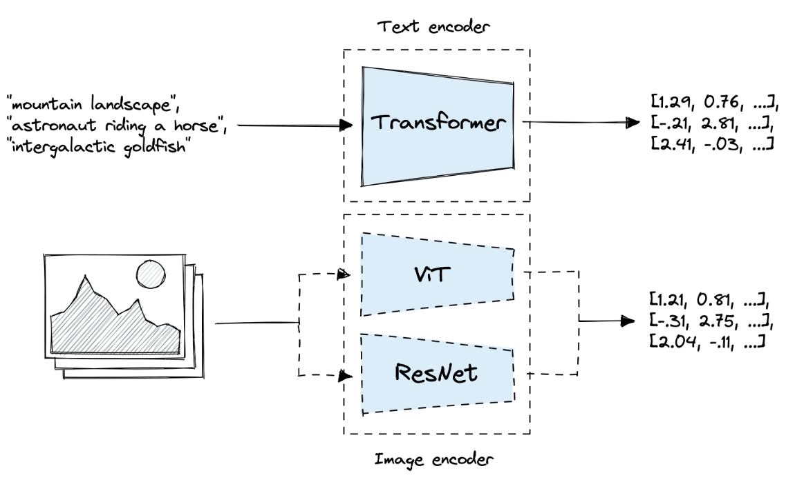
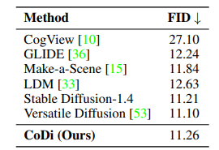
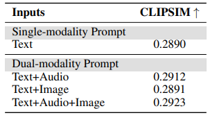
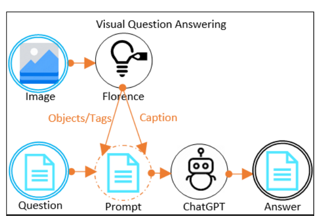

## Intro to Multimodal Models
_"... a large gap persists between the capabilities of LLMs and true humanlike intelligence. 
This is partially because humans perceive a variety of sensory inputs while LLMs are typically
restricted to Language..."_ - Microsoft Azure Cognitive Services Research (MACSR)

"_The convergence of text, visual, and audio data is a key step towards human-like
artificial intelligence_" - MACSR.
### Selling Multimodal

#### Ilya Sutskever, OpenAI chief scientist
В [недавнем интервью](https://www.nvidia.com/en-us/on-demand/session/gtcspring23-s52092/?ncid=so-yout-561702)
Илья рассказал про свое видение Multimodal направления развития ML. 
Две причины почему расширение LLM на другие модальности (в основном vision) кажется Илье интересным:

 - Humble: это просто полезно.
   Мир, как его воспринимает человек, очень визуален. 
   Поэтому полезность нейросеток без визуальной модальности не такая большая, 
   как могла бы быть если бы сетки видели то, что видят люди. 
   Кстати, в GPT-4 добавили vision, теперь это мультимодальная модель.
 - Not as clear-cut as it may seem: дополнительно учась на изображениях, 
   модель узнает и поймет больше, чем пользуясь одним текстом.
   Люди за всю жизнь слышат не более миллиарда слов, 
   и для людей важно получать информацию из всех доступных модальностей, 
   причем он считает, что мы выучиваем гораздо больше из визуальной модальности. 
   То же верно для сеток, с тем исключением, что сетки успевают увидеть триллионы слов, 
   поэтому им проще узнать много о мире из одного лишь текста. 
   Тем не менее, это неэффективно, 
   и можно гораздо быстрее понять мир пользуясь изображениями и видео.
   То есть важное преимущество, которое приносит Multimodal - 
   благодаря новым каналам информации
   становится проще обучиться понимать мир. А также приблизить понимание
   к человеческому.

Он приводит пример с GPT-4, которая начала решать математический тест 
c диаграммами в условиях сильно лучше после добавления Vision.
Илья говорит, что кроме понимания мира есть и другие аспекты:
иметь возможность рассуждать ("to reason") визуально и коммуницировать визуально -
это очень мощные вещи.
   
#### New capabilities
С Multimodal LLM-агенты становятся приспособлены к задачам, 
которые не удавалось качественно решить в Unimodal сеттинге. 
Пример: Document Editing.

[SOTA-решение](https://arxiv.org/pdf/2212.02623.pdf) (на 13 марта) 
обрабатывает документ по трем модальностям - visual, text и layout 
(разметка, тоже своего рода модальность). На вход подается изображение,
из него экстрагируется layout и text, после чего трансформер обучается на трех
связанных модальностях. Ожидаемо 
подход имеет преимущество перед наивным ViT с masked unit modelling.

### Состояние области в соответствии с недавним [обзором](https://arxiv.org/pdf/2309.10020.pdf)
Иллюстрация текущего положения дел из [обзорной статьи](https://arxiv.org/pdf/2309.10020.pdf) 
про Multimodal c упором на vision. Ниже - параллель между прогрессом Textual и Multimodal моделей.
На скрине перечислены основные модели по стадии развития - 
pre-trained модели типа BERT для NLP (e.g. CLIP, понимающий что-то про соответствия между картинками и подписями к ним),
затем более общеприменимые модели с emergent capabilities (то есть приспособленные к решению задач, на которые их не обучали прямо), 
см. [Flamingo: a Visual Language Model for Few-Shot Learning](https://arxiv.org/abs/2204.14198). И, наконец, что-то вроде GPT-4, но мультимодальное.
Скажем, GPT-4-Vision, не знаю, почему его тут нет. Авторы отделяют эту категорию от предыдущей по разрезу instruction-following и alignment.

Главные компоненты задачи (Q1-5), выделенные в той статье, в зависимости от шага в пайплайне (visual understanding, general-purpose interface посередине и visual generation на выходе).

А также классификация существующих vision-ориентированных моделей по функции. Подробности дизайна конкретных архитектур и лосс функций можно посмотреть в статье.

### Central challenges

 - Сбор и разметка данных.
К примеру, собрать сбалансированный датасет постов, содержащих составляющие из разных модальностей -
тект, изображения, видео - непростая задача. Размечать такие данные сложнее, поскольку приходится работать с несколькими каналами информации.
Кроме того, приходится решать проблемы с неточной согласованностью модальностей -
картинка может соответствовать различным частям текста (например, относиться к предыдущей странице документа), субтитры не всегда сходятся с аудиодорожками во времени.
 - Сложность модели.
Вследствие необходимости интегрировать разные типы данных мультимодальные модели имеют сложную структуру.
 - Data Fusion.
Как и в какой момент собирать разные модальности в один смешанный поток информации?
Слишком ранний или поздний Fusion приводят к нечувствительности к особенностям отдельной модальности или нечувствительности к связям между ними.
Более того, в зависимости от решаемой задачи приходится искать баланс важности между модальностями:
например, для рекомендательной системы - между текстом (тэги, жанры), визуальной частью (постеры) и аудио (саундтреки, диалоги).

### Stuff worth checking out 
[QuilLLMan](https://modal.com/docs/examples/llm-voice-chat) -- Vicuna и Whisper, смерженные в один пайплайн, то есть голосовой LLM-бот.
[Wav2Vec](https://arxiv.org/pdf/1904.05862.pdf) - как работают с аудио-модальностью? См. секцию Bimodal этой главы.
[Universal Document Processing](https://arxiv.org/pdf/2212.02623.pdf) - дублирую прикольное мультимодальное SOTA решение для редактирования документов.

## i-Code-V1

Статья https://arxiv.org/abs/2205.01818, про i-Code-V1, была опубликована
5 мая 2022 года. На то время, по словам авторов, большинство методов предобучения
были ограничены одной или двумя размерностями. В статье был представлен i-Code – 
фреймворк для предобучения без учителя, пользователи которого могут 
гибко комбинировать компьютерное зрение, голосовую речь и естественные языки, и 
получать унифицированные представления (вектора) общего вида для любой комбинации входных данных.

В данном фреймворке данные каждой размерности вначале подаются на вход в соответствующий
предобученный одноразмерный энкодер, после чего интегрируются в мультимодальную сеть слияния, которая
использует новые механизмы внимания и другие иновационные особенности архитектуры. 
Вся система проходит сквозное предобучение с новой целевой функцией потерь, 
включая модуль маскирования размерности, и мультиразмерного контрастного обучения.

i-Code может динамически обрабатывать одно, два и три-размерные данные во время обучения и инференса.
Экспериментальные результаты демонстрируют, как i-Code может превзойти самые современные (на момент написания статьи)
методы в пяти задачах на понимание видео и бенчмарке GLUE NLP, улучшая качество на целых 11%
и демонстрируя мощь интегративного мультимодального предобучения. 

### Многоразмерные мультимодальные данные для предобучения

Для эффективного мультимодального обучения авторы собрали много данных для предобучения.
Они использовали два типа данных: видео, в которых есть все три размерности и двухмодальные наборы данных.

YT-Temporal-180M был выбран для представления видео с тремя модальностями: видео, речь и текст. 
Этот набор данных состоит из 180 миллионов видеоклипов, и для каждого видеоклипа авторы выбрали 8 кадров в качестве визуальных входных данных. 
Данные речи были извлечены из аудиофрагментов и прошли дальнейшую обработку. К каждому клипу также приложены субтитры, которые 
и использовались в качетсве текстовых данных. 

Помимо видео, использовались и двухмодальные данные. Florence computer vision foundation model (Yuan et al., 2021) 
содержит 72,8 миллионов пар изображений и текстовых описаний, а набор данных язык-речь содержит 75 тысяч часов 
английской речи с соответствующими транскрипциями. Для зрения-текста использовали датасет Spoken Moments in
Time (SMiT), состоящий из 500k содержит 500 тысяч озвученных титров, каждый из
которых изображает широкий спектр различных событий в коротком видеоролике.

Это первый случай, когда парные наборы данных использовались для обучения
моделей "зрение-язык-речь".
Такое объединение различных типов данных помогло улучшить производительность модели в мультимодальном обучении.

### Архитектура модели

Архитектура модели i-Code состоит из четырех модулей. Первые три модуля - это кодировщики отдельных модальностей (видео, язык и речь). 
Последний модуль - модуль слияния модальностей. Для каждой модальности мы подаем входные данные в соответствующий кодировщик, 
затем закодированные данные проходят через линейный и объединяются в модуле слияния модальностей.

Вместо того чтобы обучать каждый кодировщик модальности с нуля, авторы разработали модульную структуру, 
позволяющую использовать предобученные модели для каждой модальности. Это обеспечивает модулю слияния высококачественные
контекстные представления для более эффективного мультимодального понимания. 

Для каждой модальности используюстя state-of-the-art модели:

* Для кодировщика языка – DeBERTa V3 base (He et al., 2020), которая обладает разделенным механизмом внимания и достигла
выдающихся результатов на бенчмарках GLUE и SuperGLUE.
* Для кодировщика видео авторы адоптировали модель CoSwin Transformer (Yuan et al., 2021). Чтобы обеспечить возможность 
обработки как изображений, так и последовательности кадров (видео), создается экземпляр видео CoSwin Transformer из
предобученной модели CoSwin Transformer, следуя процедуре, описанной в работе Liu et al. (2021b). 
CoSwin Transformer содержит 91 миллион параметров.
* Для кодировщика речи используется предобученную версия WavLM-large (Chen et al., 2021), 315 миллионов параметров.
Модель использует темпоральный сверточный энкодер для извлечения признаков из входных речевых данных (звуковая волна) и
и трансформерный энкодер для дальнейшей обработки.

#### Модуль слияния модальностей

Характеристики, извлеченные каждым кодировщиком одной модальности, проецируются в скрытый слой сети слияния с помощью 
однослойной сети прямого распростронения. Полученные признаки (вектора) подаются на вход сети слияния модальностей для 
создания интегративных мультимодальных представлений. Поскольку позиционная информация уже включена в кодировщики одиночной 
модальности, авторы не используют позиционные эмбеддинги в модуле слияния.

Основой сети слияния является трансформерный энкодер, где каждый слой выполняет перекрестное внимание между модальностями, 
прямую проекцию и нормализацию слоя. Для облегчения более эффективного понимания разных модальностей мы исследуются две 
вариации традиционного механизма внимания: merge-attention и co-attention, как показано на рис. 1.

> Рис. 1. Слева: Общая архитектура модели i-Code. Справа: слои внимания и прямого распростронения в слое сети слияния с (a) 
> merge-attention и (b) co-attention. Для упрощения для модальности естественного языка изображены только остаточные соединения.

##### Merge-attention

В этой конфигурации для разных модальностей используются одни и те же параметры внимания. Чтобы помочь 
модулю слияния различать разные модальности, к проецированным характеристикам 
добавляется уникальный идентификатор для каждой модальности. Полученные эмбеддинги из разных модальностей объединяются 
вместе и подаются на вход сети слияния, где каждый слойповторяет слои классического энкодера трансформера (Vaswani et al., 2017).

##### Co-attention

В этой конфигурации каждый слой трансформера включает вначале слой самовнимания вместе 
с уникальными параметрами для каждой модальности.

### Предобучение

#### Masked Language Modeling

Маскирование языка показало хорошие результаты как в языковых моделях(Devlin et al., 2019), так и в моделях язык-зрение(Dou et al., 2021).
Во время предобучения в i-Code маскируется 30% текстовых токенов аналогично с предобучением BERT. Цель – предсказать 
маскированные токены; функция потерь – крсс-энтропия между исходными и предсказанными токенами.

#### Masked Vision Modeling

Для предобучения зрения авторы преобразуют входные визуальные данные в дискретные токены, затем маскируют куски входных 
изображений и максимизируют кросс-энтропию между исходными и предсказанными токенами маскированного языка из кусков изображений.
Для дискретизации последовательности фреймов используется PeCo
(Dong et al., 2021). Для маскирования применяется стратегия 3D tube-masking
(Wang et al., 2021) с коэффициентом маскирования патча равным 50%. 

#### Masked Span Modeling

Для дискретизации речевых данных в последовательность токенов используется wav2vec 2.0 (Baevski et al., 2020). 
Используется такая же маскирующая стратегия как и в HuBERT (Hsu et al., 2021) и wav2vec 2.0 (Baevski
et al., 2020). Функция потерь – кросс-энтропия между исходными токенами и предсказанными. 

Про предобучение кросс-модальной части, а также про подробнсти экспериментов с разными вариантами можели
можно прочитать в оригинальной статье 
[i-Code: An Integrative and Composable Multimodal Learning Framework](https://arxiv.org/abs/2205.01818)

### Анализ результатов

На таблице выше посчитана эффективность моделей в распознавании эмоций на CMU MOSEEI.
Авторы делают вывод, что речь является наиболее хорошим предиктором среди одиночных модальностей, что логично учитывая 
эмоциональные свойства человеческой речи (Peerzada et al., 2018).
При этом использование любого набора из двух размерностей эффективнее чем речь, а самой эффективной комбинацией является 
язык+речь. Использование всех трех уже не дает прироста по отношению к речи-языку.

Также авторы замечают, что предобученные на двухмодальных наборах данных модели выигрывают у предобученных на видео, 
где встречаются все три модальности. i-Code побеждает основные модели на 5 задачах понимания видео и GLUE NLP бенчмарке.

## Bimodal
### CLIP
Мир, как цифровой, так и реальный, мультимодален. Мы воспринимаем мир как оркестр языка, образов, видео, запахов, прикосновений и многого другого. Этот хаотичный ансамбль создает внутреннее состояние, нашу “модель” внешнего мира.

Искусственный интеллект должен двигаться в том же направлении. Даже специализированные модели, ориентированные на язык или видение, должны в какой-то момент получать информацию от других модальностей. Как модель может полностью понять концепцию слова “человек”, не видя человека?

Contrastive Learning In Pretraining (CLIP) - это третья модель мирового масштаба. Он может воспринимать концепции как в тексте, так и в изображении и даже связывать концепции между двумя модальностями. В этой главе мы узнаем о мультимодальности, о том, как работает CLIP и как использовать CLIP для различных вариантов использования, таких как кодирование, классификация и обнаружение объектов.

Мультимодальный характер CLIP обеспечивается двумя моделями кодеров, обученных “говорить на одном языке”. Текстовые входные данные передаются в кодировщик текста, а графические - в кодировщик изображений. Затем эти модели создают векторное представление соответствующих входных данных.

Обе модели “говорят на одном языке", кодируя схожие концепции в тексте и изображениях в схожие векторы. Это означает, что текст “две собаки, бегущие по морозному полю” будет выводить вектор, подобный изображению двух собак, бегущих по морозному полю.

Мы можем представить язык, на котором говорят эти модели, как векторное пространство, в котором они кодируют векторы. Эти две модели могут передавать тонкую информацию о тексте и изображениях через это векторное пространство. Однако этот “векторный язык” слишком абстрактен, чтобы мы могли его понять напрямую.

Вместо непосредственного чтения этого “языка” мы можем обучить другие простые нейронные сети понимать его и делать понятные нам прогнозы. Или мы используем векторный поиск для выявления похожих концепций и шаблонов в текстовой и графической областях.

Давайте посмотрим на CLIP в действии.

CLIP фактически состоит из двух моделей, обучаемых параллельно. 12-слойный преобразователь текста для построения текстовых вложений и ResNet или vision transformer (ViT) для построения графических вложений.

Кодировщик текста и кодировщик изображений (ResNet или ViT) выводят отдельные векторные вложения для каждой записи текста / изображения, загружаемой в кодировщики. Все векторы имеют 512 измерений и могут быть представлены в одном векторном пространстве, что означает, что похожие изображения и текст создают векторы, которые появляются рядом друг с другом.

#### Contrastive Pretraining

Идея заключается в том, что, предоставляя большой модели много данных, они могут извлекать общие закономерности из набора данных.

Для языковых моделей это могут быть общие правила и шаблоны английского языка. Для визуальных моделей это могут быть характеристики различных сцен или объектов.

Проблема мультимодальности заключается в том, что эти модели обучаются отдельно и по умолчанию не понимают друг друга. CLIP решает эту проблему благодаря изображению и тексту контрастное предварительное обучение. С CLIP кодировщики текста и изображений обучаются с учетом другой модальности и контекста. Это означает, что кодировщики текста и изображений разделяют “косвенное понимание” шаблонов в обеих модальностях; языке и видении.

Контрастивное предварительное обучение работает путем взятия пары (текст, изображение), где текст описывает изображение, и обучения кодированию пар как можно точнее в векторном пространстве.

Чтобы это работало хорошо, нам также нужны отрицательные пары для обеспечения контрастного сравнения. Нам нужны положительные пары, которые должны выводить похожие векторы, и отрицательные пары, которые должны выводить разные векторы.

Это общая идея контрастного обучения, которую можно найти в обучающих функциях многих моделей, особенно тех, которые создают векторы встраивания.

Отрицательные пары могут быть извлечены непосредственно из положительных пар. Если у нас есть положительные пары  $(T_1, I_1)$ и $(T_2, I_2)$, то мы просто меняем компоненты местами, получая отрицательные пары $(T_1, I_2)$ и $(T_2, I_1)$.
 
При этом мы можем применить функцию потерь, которая максимизирует сходство между $(T_1, I_1)$ и $(T_2, I_2)$ и минимизирует сходство между $(T_1, I_2)$ и $(T_2, I_1)$. В целом это выглядит так:

На этом изображении мы можем видеть один этап предварительной подготовки для одной партии. Функция потерь предполагает, что пары по диагонали должны иметь максимальное значение точечного произведения, а все остальные пары должны иметь минимальное значение точечного произведения. Для этого оптимизированы как текстовые, так и графические кодеры.

Фундаментальное предположение заключается в том, что в одной партии нет других положительных пар. Например, мы предполагаем, что “две собаки, бегущие по морозному полю” относится только к изображению, с которым оно сопряжено. Мы предполагаем, что других текстов или изображений с похожим значением нет.

Это предположение возможно, поскольку наборы данных, используемые для предварительного обучения, разнообразны и достаточно велики, так что вероятность появления двух похожих пар в одном пакете ничтожно мала. Таким образом, он достаточно редкий, чтобы практически не оказывать негативного влияния на результаты перед тренировкой.

### Wav2Vec
Если выше мы говорили о связи картинок и текста, то теперб давайте поговорим о связи звука и текста.

Нейронные сети на основе трансформаторов произвели революцию в области обработки естественного языка, но только начинают набирать популярность в сообществе специалистов по обработке речи. Wav2vec 2.0 призван изменить это. Его архитектура основана на кодере Transformer, с обучающей целью, аналогичной цели моделирования языка в маске БЕРТА, но адаптированной для речи.

Этот новый метод позволяет проводить эффективное [обучение под контролем](https://en.wikipedia.org/wiki/Weak_supervision): сначала предварительно обучите модель большому количеству немаркированной речи, затем выполните точную настройку на меньшем маркированном наборе данных. В [оригинальной статье wav2vec 2.0](https://proceedings.neurips.cc/paper/2020/hash/92d1e1eb1cd6f9fba3227870bb6d7f07-Abstract.html) авторы продемонстрировали, что точная настройка модели всего на одном часе помеченных речевых данных может превзойти предыдущие современные системы, обученные на в 100 раз большем количестве помеченных данных.

Посмотрим на архитектуру wav2vec 2.0 подробнее:

#### Feature encoder

Задача кодировщика функций заключается в уменьшении размерности аудиоданных, преобразовывая исходную форму сигнала в последовательность векторов функций $Z_0, Z_1, Z_2, …, Z_T$ каждые 20 миллисекунд. Его архитектура проста: 7-слойная сверточная нейронная сеть (одномерная) с 512 каналами на каждом уровне.

Форма сигнала нормализуется перед отправкой в сеть, а ширина ядра и шаги сверточных слоев уменьшаются по мере того, как мы поднимаемся выше в сети. Общее поле восприятия функционального кодера составляет 400 сэмплов, или 25 мс звука (аудиоданные кодируются с частотой дискретизации 16 кГц).

#### Quantization module

Одним из основных препятствий при использовании преобразователей для обработки речи является непрерывный характер речи. Письменный язык может быть естественным образом разделен на слова или подслова, что создает ограниченный словарь отдельных единиц. В речи нет таких естественных подразделений. Мы могли бы использовать телефоны как дискретную систему, но тогда нам понадобилось бы, чтобы люди предварительно помечали весь набор данных, поэтому мы не смогли бы предварительно обучаться работе с немаркированными данными.

Wav2vec 2.0 предлагает автоматическое изучение отдельных единиц речи путем выборки из [Gumbel-Softmax distribution](https://paperswithcode.com/method/gumbel-softmax). Возможные единицы состоят из кодовых слов , выбранных из кодовых книг (группы). Кодовые слова затем объединяются, образуя конечную речевую единицу. В Wav2vec используются 2 группы по 320 возможных слов в каждой, следовательно, теоретический максимум составляет 320 $\times$ 320 = 102 400 речевых единиц.

Скрытые характеристики умножаются на матрицу квантования, чтобы получить логические значения: по одному баллу за каждое из возможных кодовых слов в каждой кодовой книге. Gumbel-Softmax trick позволяет выбрать одно кодовое слово из каждой кодовой книги после преобразования логитов в вероятности. Это похоже на использование argmax, за исключением того, что операция полностью дифференцируема. Кроме того, в процесс выборки введен небольшой эффект случайности, действие которого контролируется температурным параметром, чтобы облегчить обучение и использование кодовых слов.

#### Context network

Ядром wav2vec 2.0 является его преобразовательный кодер, который принимает в качестве входных данных векторы скрытых признаков и обрабатывает их через 12 блоков преобразования для получения База версия модели, или 24 блока для Большой версия. Чтобы соответствовать внутреннему размеру преобразователя кодирования, последовательность ввода сначала должна пройти через слой проекции объектов, чтобы увеличить размер с 512 (выходной сигнал CNN) до 768 для *BASE* или 1,024 за *LARGE*.

Одно из отличий от оригинальной архитектуры Transformer заключается в том, как позиционная информация добавляется к входным данным. Поскольку функция self-attention у тарнсформера не сохраняет порядок входной последовательности, к входным векторам в исходной реализации были добавлены фиксированные предварительно сгенерированные позиционные вложения.

#### Pre-training & contrastive loss

В процессе предварительной подготовки используется контрастивная задача для тренировки на немаркированных речевых данных. Маска сначала случайным образом применяется в скрытом пространстве, где ~ 50% проецируемых векторов это скрытые объекты. Замаскированные позиции затем заменяются тем же обученным вектором $Z_M'$ перед подачей в сеть трансформатора.

Затем окончательные векторы контекста проходят через последний слой проекции, чтобы соответствовать размеру квантованных речевых единиц $Q_t$. Для каждой замаскированной позиции, 100 отрицательных дистракторов равномерно выбираются из других позиций в том же предложении. Затем модель сравнивает сходство между спроецированным контекстным вектором $C_t'$ и истинная позитивная цель $Q_p$ вместе со всеми негативными отвлекающими факторами $Q_с$. Затем потеря контраста способствует высокому сходству с истинно положительной целью и наказывает за высокие показатели сходства с отрицательными отвлекающими факторами.

#### Diversity loss

Во время предварительной подготовки к contrastive loss добавляется еще один loss, чтобы побудить модель использовать все кодовые слова одинаково часто. Это работает за счет максимизации энтропии для Gumbel-Softmax distribution, не позволяющий модели всегда выбирать из небольшой подгруппы всех доступных записей кодовой книги. Более подробную информацию вы можете найти в [оригинальной статье](https://proceedings.neurips.cc/paper/2020/hash/92d1e1eb1cd6f9fba3227870bb6d7f07-Abstract.html).

В завершиние хочется сказасть, что полученную предварительно обученную модель можно использовать для множества последующих задач с речью: автоматическое распознавание речи, [определение эмоций](https://jonathanbgn.com/speech/2020/10/31/emotion-recognition-transfer-learning-wav2vec.html), распознавание говорящего, определение языка… В оригинальной статье авторы напрямую доработали модель для распознавания речи с [потерей CTC](https://distill.pub/2017/ctc/), добавив линейную проекцию поверх контекстной сети для прогнозирования токена слова на каждом временном шаге.

### И ещё пара слов

Разные типы задач, решаемые одной моделью — это тоже своего рода мультимодальность. Например, классификация изображений и генрация (или object detection). Самый простой случай это, когда одна и та же модель (предобученный ViT) решает принципиально разные задачи. За счет чего так выходит? За счет семантической связности этих задач. Подробнее об этом можно поситать в статье [Exploring Plain Vision Transformer Backbones for Object Detection](https://arxiv.org/pdf/2203.16527.pdf).

## I-Code V3(CoDi): Any-to-Any Generation via Composable Diffusion

Уже существуют генеративные модели, работающие с несколькими модальностями(чаще всего с текстом и изображениями). 
Однако авторы [статьи](https://arxiv.org/pdf/2305.11846.pdf) пошли дальше и предложили модель $CoDi$, 
способную обрабатывать и генерировать произвольные наборы модальностей. 

До этого модели были ограничены требуемыми данными, которые должны содержать разные модальности и при этом 
соотноситься друг с другом. Например, нужно видео с аудиодорожкой и при этом должно быть некоторое текстовое описание для него. 
Очевидно, таких данных не много. А последовательно из одной модальности генерировать следующую - долго, 
дорого и качество такой генерации будет ограничено.

### Общая схема обучения

Во-первых, авторы обучили латентные диффузионные модели (LDM) для каждой модальности(текст, изображения, видео и аудио). 
Так получили качественные одномодальные генеративные модели. Для условной межмодальной 
генерации(например, по тексту генерировать аудио) входные модальности проецируются в общее пространство признаков. 
Такой механизм подготавливает диффузионную модель к обуславливанию на произвольный набор модальностей, без прямого обучения для этого. 

Во-вторых, добавляются модули cross-atetntion для каждого диффьюзера и environment encoder V для проекции 
латентных переменных разных LDM в общее пространство признаков. Далее замараживаются LDM. Поскольку V для каждого энкодера выравнены, LDM могут взаимодействовать с люым набором модальностей, интерполируя входные данные эмбеддингами из V.

### Composable Multimodal Conditioning

Одновременная оптимизация всех четырех кодеров подсказок комбинаторным способом требует больших вычислительных затрат при наличии $O(n_2)$ пар. Более того для некторых модальностей мало парных датасетов(например, изображение и аудио). Чтобы решить эту проблему, авторы предлажили метод "Bridging Alignment" для выравнивания энкодеров. В качестве связующей модальности выбран текст, так как с ним существует множество парных датасетов. 

### Composable Diffusion

#### Image Diffusion Model

Для энкодеров изобраений была выбрана архитектура Stable Diffusion 1.5 и инициализирована теми же весами. Повторное использование весов переносит знания и исключительную точность генерации Stable Diffusion 1.5, обученной на крупномасштабных наборах данных изображений высокого качества.

#### Video Diffusion Model

Чтобы моделировать временные свойства видео и одновременно поддерживать
качество генерации видения, создается видео diffuser, расширяя diffuser изображений временными модулями. В частности, используем псевдовременной механизм внимания перед residual блоком. Однако утверждается, что псевдовременное внимание позволяет видеокадрам глобально взаимодействовать друг с другом только путем выравнивания пикселей (размерность высоты, ширины), что приводит к
отсутствию межкадрового взаимодействия между локальными пикселями. Авторы утверждают, что это приводит к общей проблеме временной несогласованности расположения, формы и цвета при генерации видео. Для решения этой проблемы предлагается адаптировать метод скрытого
сдвига, который выполняет пространственно-временные сдвиги скрытых объектов в соответствии с временным
вниманием. Видео делится по скрытому измерению на k = 8 фрагментов, и для каждого фрагмента i = от 0 до 7 мы сдвигаем временное измерение вперед на i позиций. 

#### Audio Diffusion Model
Чтобы обеспечить гибкое переключение между модальностями при совместной генерации, аудиодиффузор спроектирован так, чтобы иметь архитектуру, аналогичную визуальным диффузорам, где mel-спектрограмму можно естественным образом рассматривать как изображение с 1 каналом. Используется энкодер VAE для кодирования мелспектрограммы звука в сжатое скрытое пространство. При синтезе звука декодер VAE сопоставляет скрытую
переменную с mel-спектрограммой, а vocoder генерирует аудиосэмпл из mel-спектрограммы.

#### Text Diffusion Model

VAE для текстового LDM является OPTIMUS, а его кодировщиком и декодером являются BERT и GPT-2 соответственно. Для денойзинга UNet, в отличие от UNet в image diffusion, $2D$ свертка в residual блоках заменяется одномерной сверткой.

### Joint Multimodal Generation by Latent Alignment

Заключительный шаг заключается в обеспечении перекрестного внимания между потоками диффузии при одновременной генерации двух или более модальностей. Это достигается добавлением подуровней перекрестного внимания к UNet θ. 
V (·) различных модальностей обучаются для выравнивания с помощью contrastive learning. Задача V - достигнуть генерации людых наборов модальностей. В итоге, CoDi может генерировать модальности A и B, хотя в данных были только пары A-C и D-C.

### Результаты

 

## I-Code Studio: A Configurable and Composable Framework for Integrative AI

Интегративный ИИ является одним из важных направлений подхода
AGI, посредством объединения нескольких моделей для
решения сложных мультимодальных задач. В этой [статье](https://arxiv.org/pdf/2305.13738.pdf) Microsoft предлагает i-Code Studio, настраиваемый
и компонуемый фреймворк для интегративного AGI. I-Code Studio объединяет несколько предобученных моделей без fine-tuning'а для выполнения сложных мультимодальных задач. Вместо композиции моделей i-Code Studio предоставляет интегративную, гибкую и компонуемую среду, позволяющую разработчикам быстро и легко
создавать передовые сервисы и технологии, адаптированные к их конкретным требованиям.
I-Code Studio добивается впечатляющих результатов при
выполнении различных мультимодальных задач в zero-shot формате, таких как
преобразование видео в текст, перевод речи в речь и визуальные ответы на вопросы.

### The i-Code Studio Framework

Для сложных мультимодальных задач,
i-Code Studio предоставляет
разработчикам универсальную платформу для быстрой и простой интеграции и создания нескольких больших предварительно обученных моделей и сервисов
в различных модальностях без какого-либо обучения или
fine-tuning'а.

Для каждой задачи фреймворк может быть представлен
с помощью DAG, где узлы без входящего ребра
являются необработанными входными данными, такими как изображение, текст, видео
и речь, узлы без исходящих ребер являются
выходными данными данной задачи, а остальные
узлы являются базовыми моделями/сервисами или хранить промежуточные выходные данные модели из других моделей/сервисов.
Входные данные для узла поступают из необработанных входных данных
и/или выходных данных предыдущих узлов. Входные
данные проходят через каждый узел в DAG, позволяя
выполнять сложные мультимодальные задачи.
Исходящий ребро от узла модели/сервиса представляет
API, предоставляемый моделью/сервисом. Для каждой задачи, входные данные поступают в DAG из входных узлов
и обрабатываются одной или несколькими моделями или
сервисами моделей. 

Для каждой задачи DAG настраивается таким образом, чтобы
связанные модели взаимодействовали для получения желаемого
результата. Различные компоненты i-Code Studio взаимодействуют, образуя единое интегрированное
решение и его можно настроить в соответствии с конкретными
потребностями пользователя. Например, для
задачи "Ответы на визуальные вопросы" (VQA) входными данными являются изображение и
вопрос, связанный с изображением (см. рис. 2).
Сначала мы можем применить к входному изображению службы субтитров и обнаружения объектов. Выходной текст,
содержащий визуальную информацию, объединяется
с вводимым вопросом в качестве запроса для ChatGPT,
который отвечает на вопрос. Для преобразования речи в речь
в DAG настроено распознавание речи
(SR) → Машинный перевод (MT) →
Преобразование текста в речь (TTS). Этот DAG расшифровывает
исходную речь, переводит транскрипцию на
целевой язык и генерирует целевую речь.

### Результаты

